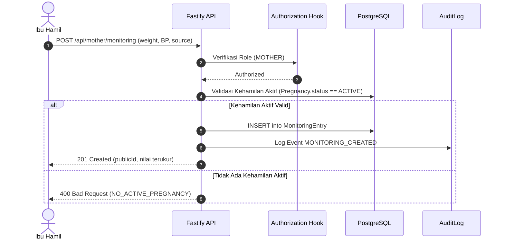
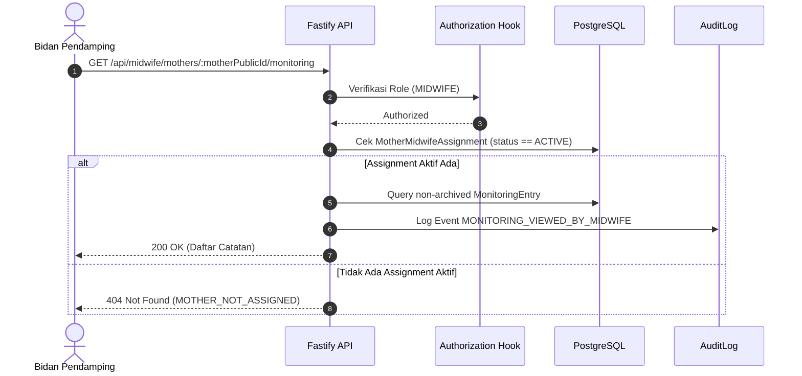

# Arsitektur dan Alur Pemantauan Fisik Mandiri (Tahap 4A)

## 1. Diagram Alur Pencatatan Monitoring

## 2. Diagram Alur Akses Bidan Pendamping

## 3. Prinsip Keamanan & Desain Data
1. **Zero Clinical Diagnostic Leaks**: Pada Tahap 4A, backend murni berfungsi sebagai pencatat fakta pengukuran. Tidak ada aturan klinis otomatis, tidak ada diagnosis hipertensi, preeklamsia, atau status gizi.
2. **Strict Role Isolation**:
   - `MOTHER`: Memiliki isolasi penuh berbasis `userId` pada token JWT.
   - `MIDWIFE`: Hanya memiliki akses ke ibu binaan dengan penugasan `ACTIVE`.
   - `ADMIN`: Akses monitoring ditolak untuk menjaga privasi medis.
3. **Data Immutability & Audit Trail**:
   - Tidak ada penghapusan permanen dari database (`archivedAt` timestamp digunakan).
   - Setiap mutasi dicatat dalam tabel `AuditLog` dengan metadata ringkas dan aman.
