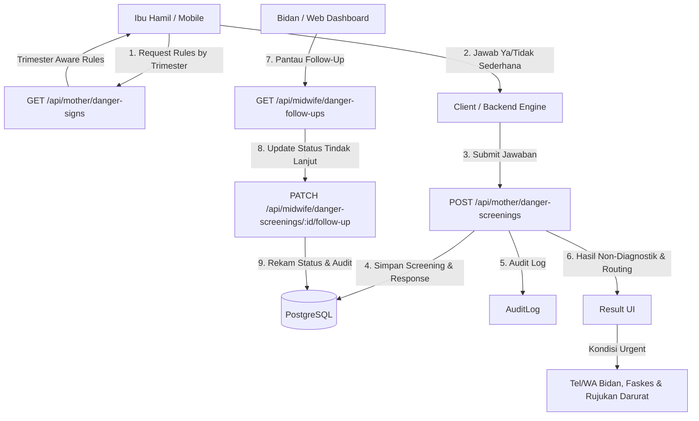

# Arsitektur Skrining Tanda Bahaya — PFRAM Telemedicine (Tahap 6A)

## 1. Arsitektur & Prinsip Desain
Modul Skrining Tanda Bahaya Kehamilan dirancang untuk menyediakan deteksi dini non-diagnostik terhadap kegawatdaruratan obstetri.

---

## 2. Model Data & Hubungan Relasional
1. **`DangerSignRuleSet`**:
   Menyimpan bundel aturan versioned (misal `KEMENKES-KIA-2023-V1`).
2. **`DangerSignRule`**:
   Butir-butir tanda bahaya dengan kode stabil, pertanyaan, bobot keparahan (`URGENT` / `WARNING`), dan filter relevansi trimester.
3. **`DangerScreening`**:
   Entri pencatatan skrining individual ibu hamil, memuat ringkasan, stempel waktu, status non-diagnostik, dan siklus hidup tindak lanjut (*follow-up*).
4. **`DangerScreeningResponse`**:
   Rincian butir per pertanyaan yang dijawab oleh ibu (jawaban `true` untuk YA, `false` untuk TIDAK).

---

## 3. Ketahanan Jaringan & Offline Safety
Jika terjadi gangguan koneksi internet saat ibu menekan tombol "Kirim Jawaban":
1. State jawaban form lokal **TIDAK HILANG** dan tetap tersimpan di memori perangkat.
2. Jika ada butir `URGENT` yang dijawab "YA", aplikasi mobile **SEGERA** menampilkan peringatan darurat:
   > *"Segera menuju fasilitas kesehatan. Jangan menunggu balasan melalui aplikasi."*
   lengkap dengan tombol aksi telepon Bidan & Fasilitas Kesehatan, meskipun pengiriman ke server tertunda atau gagal.
3. Tombol "Coba Lagi" disediakan agar ibu dapat mengirimkan data saat jaringan pulih tanpa harus menjawab ulang dari awal.
