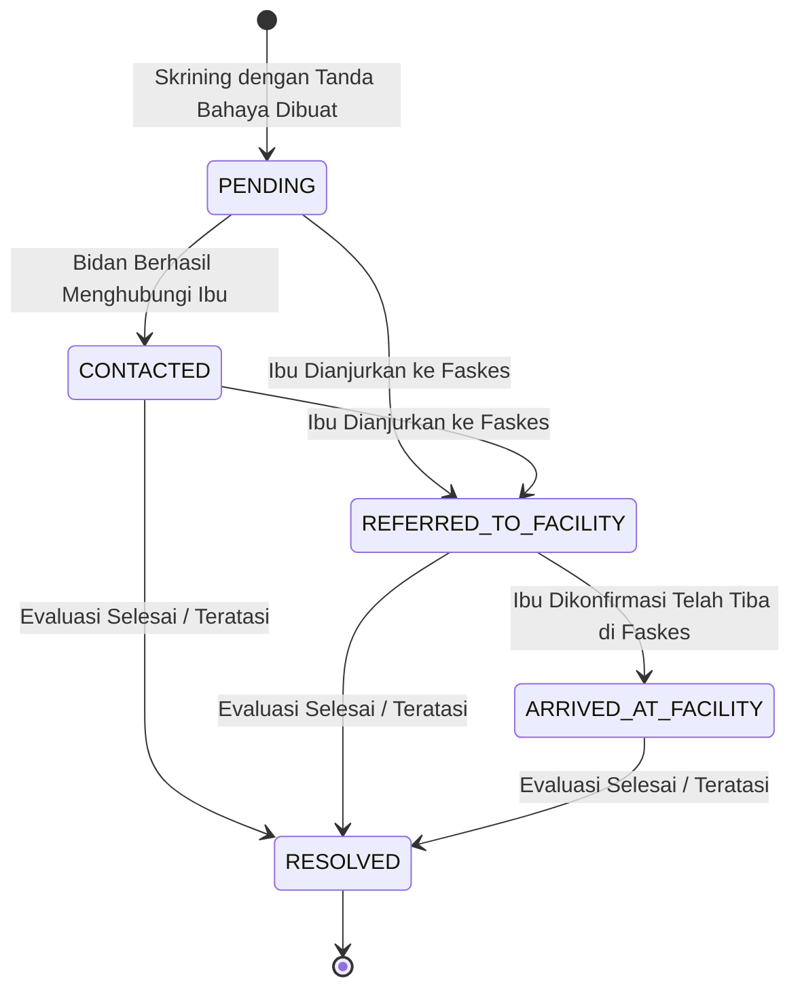

# Alur Kerja Tindak Lanjut Bidan (Follow-Up Workflow) — PFRAM Telemedicine (Tahap 6A)

## 1. Konsep & Filosofi
Modul tindak lanjut (*follow-up*) pada Dashboard Web Bidan bertujuan memfasilitasi pendampingan aktif oleh bidan terhadap ibu hamil yang melaporkan tanda bahaya.
Alur ini bersifat administratif operasional dan **BUKAN** rekaman diagnosis medis.

---

## 2. Siklus Hidup Status Tindak Lanjut (`DangerFollowUpStatus`)

### Definisi Status:
1. **`PENDING`**: Skrining baru saja dilaporkan oleh ibu dengan tanda bahaya dan belum direspons oleh bidan pendamping.
2. **`CONTACTED`**: Bidan telah menghubungi ibu via telepon / chat untuk menanyakan kondisi saat ini.
3. **`REFERRED_TO_FACILITY`**: Bidan menginstruksikan ibu untuk segera memeriksakan diri ke Puskesmas / Rumah Sakit.
4. **`ARRIVED_AT_FACILITY`**: Ibu dikonfirmasi telah berada di fasilitas kesehatan untuk penanganan langsung.
5. **`RESOLVED`**: Proses tindak lanjut selesai (misal ibu sudah ditangani di faskes atau keluhan telah dievaluasi nakes secara tatap muka).

---

## 3. Daftar "Perlu Tindak Lanjut" (Attention Queue)
Daftar `GET /api/midwife/danger-follow-ups` menampilkan ibu binaan aktif dengan kriteria:
1. Status skrining bukan `NO_DANGER_REPORTED`.
2. Status tindak lanjut (`followUpStatus`) belum `RESOLVED`.
3. Bidan memiliki penugasan aktif (`assignment.status = ACTIVE`).
4. Ibu memiliki profil kehamilan aktif (`pregnancy.status = ACTIVE`).
5. Bukan data yang diarsipkan (`archivedAt IS NULL`).
