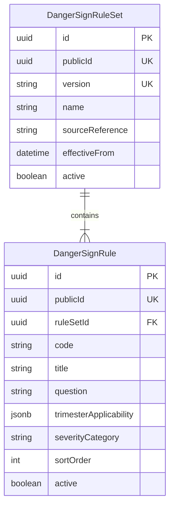

# Versioning Aturan Tanda Bahaya — PFRAM Telemedicine (Tahap 6A)

## 1. Tujuan & Prinsip Versioning
Dalam ranah kesehatan ibu dan anak, panduan klinis dari Kementerian Kesehatan RI atau WHO dapat mengalami pembaharuan berkala (misalnya penambahan kriteria skrining atau perubahan wording edukasi).
Agar integritas rekam medis masa lalu tidak terdistorsi oleh perubahan aturan di masa depan:
1. **Aturan Tidak Boleh Di-hardcode di UI.**
2. Setiap pengujian skrining mengikat versi aturan yang aktif saat skrining dilakukan (`ruleSetVersion`).
3. Butir skrining historis (`DangerScreeningResponse`) menyimpan salinan teks pertanyaan dan kode rule saat pengisian, sehingga bila teks diubah di masa depan, catatan historis tetap utuh dan dapat diaudit secara hukum (*forensic audit readiness*).

---

## 2. Struktur Versioned Rule Set

---

## 3. Manajemen Aturan oleh Administrator
1. Admin dapat melihat daftar versi rule set dan versi yang aktif saat ini (`GET /api/admin/danger-rules`).
2. Admin dapat mengaktifkan versi baru yang telah diterbitkan oleh tim medis resmi.
3. Aturan isolasi klinis (*clinical isolation*) memastikan Administrator **TIDAK** memiliki izin membuka data skrining personal ibu binaan tanpa alasan penugasan administratif berizin.
