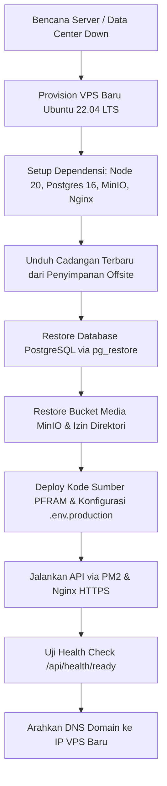

# Prosedur Backup & Restore — PFRAM Telemedicine

Dokumen ini merupakan panduan operasional standar (*Standard Operating Procedure* / SOP) untuk strategi pencadangan (*backup*), verifikasi integritas berkala, pengujian pemulihan (*restore drill*), dan penanganan bencana (*disaster recovery*) untuk seluruh komponen data sistem **PFRAM Telemedicine**.

---

## 1. Arsitektur Data & Parameter Target Pemulihan

Sistem PFRAM Telemedicine mengelola dua jenis data persisten utama:

1. **Database Relasional (PostgreSQL 16):**
   - Data akun pengguna (Ibu, Bidan, Administrator).
   - Data master wilayah, fasilitas kesehatan, penugasan bidan pendamping.
   - Rekam klinis: pemantauan fisik BB/TD, jadwal dan kepatuhan ANC, skrining tanda bahaya Buku KIA 2024, perencanaan persalinan P4K, rencana rujukan kepulauan, konsultasi telemedisin, jadwal video call, dan kunjungan rumah (*home visit*).
   - Log audit administratif dan jejak aktivitas sistem.
2. **Object Storage Privat (MinIO S3):**
   - Media lampiran telekonsultasi (foto hasil pemeriksaan, Buku KIA, USG).
   - Berkas rekaman audio pesan suara (*voice note*).
3. **Konfigurasi Lingkungan (*Environment Secrets*):**
   - Berkas `.env.production` server (tersimpan aman di server lokal, tidak dikomit ke repositori publik).

### Parameter Operasional RPO & RTO
| Parameter | Target Operasional | Keterangan |
|---|---|---|
| **RPO (Recovery Point Objective)** | $\le$ 24 Jam | Titik pemulihan data maksimal terikat pada jadwal backup otomatis harian (pukul 02.00 WIT). |
| **RTO (Recovery Time Objective)** | $\le$ 2 Jam | Waktu maksimal yang dibutuhkan tim untuk memulihkan seluruh layanan pada server baru / server yang pulih. |
| **Retensi Cadangan Lokal** | 14 Hari | Disimpan pada direktori lokal server `/var/backups/pfram`. |
| **Retensi Cadangan Offsite** | 30 Hari | Disimpan pada penyimpanan sekunder awan (S3 / Cloudflare R2 / remote backup). |

---

## 2. Keamanan Kredensial & Lokasi Penyimpanan

> [!IMPORTANT]
> **DILARANG KERAS** menuliskan kata sandi (*password*) PostgreSQL atau secret key MinIO secara *hard-coded* di dalam naskah skrip shell (`.sh`) atau konfigurasi crontab.

Kredensial disimpan dalam berkas lingkungan terproteksi khusus backup dengan izin akses `600`:

Buat berkas `/etc/pfram/backup.env`:
```bash
sudo mkdir -p /etc/pfram
sudo touch /etc/pfram/backup.env
sudo chmod 600 /etc/pfram/backup.env
sudo chown root:root /etc/pfram/backup.env
```

Isi berkas `/etc/pfram/backup.env`:
```env
# Konfigurasi Database PostgreSQL 16
PGHOST="127.0.0.1"
PGPORT="5432"
PGDATABASE="pfram_prod"
PGUSER="pfram_prod"
PGPASSWORD="ISI_PASSWORD_POSTGRES_PRODUKSI"

# Konfigurasi MinIO Object Storage
MINIO_DATA_DIR="/var/minio/data"
MINIO_BUCKET="pfram-private"

# Lokasi Direktori Cadangan & Retensi
BACKUP_BASE_DIR="/var/backups/pfram"
RETENTION_DAYS=14
```

Struktur folder cadangan:
```text
/var/backups/pfram/
├── postgres/
│   └── pfram_db_YYYYMMDD_HHMMSS.dump
└── minio/
    └── minio_media_YYYYMMDD_HHMMSS.tar.gz
```

---

## 3. Skrip Otomasi Backup Harian (`/usr/local/bin/pfram-backup.sh`)

Buat berkas skrip cadangan terpadu di `/usr/local/bin/pfram-backup.sh`:

```bash
#!/usr/bin/env bash
# ==============================================================================
# PFRAM Telemedicine — Automated Daily Backup Script
# Lokasi: /usr/local/bin/pfram-backup.sh
# ==============================================================================
set -euo pipefail

# 1. Muat kredensial dari file lingkungan aman
ENV_FILE="/etc/pfram/backup.env"
if [[ ! -f "$ENV_FILE" ]]; then
    echo "[ERROR] File konfigurasi $ENV_FILE tidak ditemukan!" >&2
    exit 1
fi
# shellcheck disable=SC1090
source "$ENV_FILE"

TIMESTAMP=$(date +"%Y%m%d_%H%M%S")
PG_BACKUP_DIR="${BACKUP_BASE_DIR}/postgres"
MINIO_BACKUP_DIR="${BACKUP_BASE_DIR}/minio"
LOG_PREFIX="[PFRAM-BACKUP $(date +'%Y-%m-%d %H:%M:%S')]"

mkdir -p "$PG_BACKUP_DIR" "$MINIO_BACKUP_DIR"
chmod 700 "$BACKUP_BASE_DIR"

echo "$LOG_PREFIX Memulai pencadangan harian..."

# ------------------------------------------------------------------------------
# 2. Backup PostgreSQL 16 via pg_dump (Format Custom Terkompresi -Fc)
# ------------------------------------------------------------------------------
PG_TARGET_FILE="${PG_BACKUP_DIR}/pfram_db_${TIMESTAMP}.dump"
echo "$LOG_PREFIX Mencadangkan PostgreSQL ke ${PG_TARGET_FILE}..."

export PGHOST PGPORT PGDATABASE PGUSER PGPASSWORD
pg_dump \
    --format=custom \
    --compress=6 \
    --no-owner \
    --no-privileges \
    --file="${PG_TARGET_FILE}"

chmod 600 "${PG_TARGET_FILE}"

# Verifikasi integritas: file tidak boleh 0 byte & struktur arsip harus valid
if [[ ! -s "${PG_TARGET_FILE}" ]]; then
    echo "[ERROR] File backup database kosong atau gagal dibuat!" >&2
    exit 1
fi

pg_restore --list "${PG_TARGET_FILE}" > /dev/null 2>&1 || {
    echo "[ERROR] Verifikasi integritas pg_restore gagal untuk ${PG_TARGET_FILE}!" >&2
    exit 1
}
echo "$LOG_PREFIX PostgreSQL berhasil dicadangkan dan diverifikasi (Ukuran: $(du -h "${PG_TARGET_FILE}" | cut -f1))."

# ------------------------------------------------------------------------------
# 3. Backup MinIO Object Storage
# ------------------------------------------------------------------------------
MINIO_TARGET_FILE="${MINIO_BACKUP_DIR}/minio_media_${TIMESTAMP}.tar.gz"
echo "$LOG_PREFIX Mencadangkan media MinIO bucket ${MINIO_BUCKET}..."

if [[ -d "${MINIO_DATA_DIR}/${MINIO_BUCKET}" ]]; then
    tar -czf "${MINIO_TARGET_FILE}" -C "${MINIO_DATA_DIR}" "${MINIO_BUCKET}"
    chmod 600 "${MINIO_TARGET_FILE}"

    # Verifikasi integritas arsip gzip
    gzip -t "${MINIO_TARGET_FILE}" || {
        echo "[ERROR] Integritas arsip gzip MinIO korup: ${MINIO_TARGET_FILE}!" >&2
        exit 1
    }
    echo "$LOG_PREFIX MinIO media berhasil dicadangkan (Ukuran: $(du -h "${MINIO_TARGET_FILE}" | cut -f1))."
else
    echo "$LOG_PREFIX [WARN] Direktori ${MINIO_DATA_DIR}/${MINIO_BUCKET} belum ada atau kosong. Melewati backup MinIO."
fi

# ------------------------------------------------------------------------------
# 4. Rotasi Pembersihan Data Lama (Retention Policy)
# ------------------------------------------------------------------------------
echo "$LOG_PREFIX Membersihkan file backup yang berumur lebih dari ${RETENTION_DAYS} hari..."
find "${PG_BACKUP_DIR}" -type f -name "pfram_db_*.dump" -mtime +"${RETENTION_DAYS}" -delete
find "${MINIO_BACKUP_DIR}" -type f -name "minio_media_*.tar.gz" -mtime +"${RETENTION_DAYS}" -delete

# ------------------------------------------------------------------------------
# 5. Offsite Sync (Opsional: Rclone ke Remote Storage Sekunder)
# ------------------------------------------------------------------------------
if command -v rclone &> /dev/null; then
    if rclone listremotes | grep -q "^pfram-offsite:"; then
        echo "$LOG_PREFIX Menyinkronkan cadangan ke penyimpanan off-site..."
        rclone sync "${BACKUP_BASE_DIR}" pfram-offsite:pfram-backups/ --quiet || {
            echo "$LOG_PREFIX [WARN] Gagal menyinkronkan ke remote offsite."
        }
    fi
fi

echo "$LOG_PREFIX Pencadangan harian sukses diselesaikan."
```

Pasang izin eksekusi skrip:
```bash
sudo chmod 700 /usr/local/bin/pfram-backup.sh
sudo chown root:root /usr/local/bin/pfram-backup.sh
```

### Konfigurasi Cron Harian
Buka crontab root:
```bash
sudo crontab -e
```
Tambahkan jadwal pencadangan harian pada pukul **02.00 WIT** (17.00 UTC):
```cron
# PFRAM Telemedicine — Daily Automated Backup (02:00 WIT / 17:00 UTC)
0 17 * * * /usr/local/bin/pfram-backup.sh >> /var/log/pfram-backup.log 2>&1
```

---

## 4. Prosedur Pemulihan Data (Restoration Guide)

### 4.1. Pemulihan Database PostgreSQL

Jika terjadi kesalahan operasional, korupsi data, atau kebutuhan *rollback* skema:

1. **Hentikan sementara layanan aplikasi backend:**
   ```bash
   pm2 stop pfram-api
   ```

2. **Pilih berkas dump cadangan yang akan dipulihkan:**
   ```bash
   ls -lh /var/backups/pfram/postgres/
   ```

3. **Tutup semua koneksi aktif ke database produksi:**
   ```bash
   sudo -u postgres psql -c "
   SELECT pg_terminate_backend(pid)
   FROM pg_stat_activity
   WHERE datname = 'pfram_prod' AND pid <> pg_backend_pid();"
   ```

4. **Drop dan Recreate Database:**
   ```bash
   sudo -u postgres dropdb pfram_prod
   sudo -u postgres createdb -O pfram_prod pfram_prod
   ```

5. **Eksekusi Pemulihan dengan `pg_restore`:**
   ```bash
   sudo -u postgres pg_restore \
       --dbname=pfram_prod \
       --no-owner \
       --no-privileges \
       --clean \
       --if-exists \
       /var/backups/pfram/postgres/pfram_db_YYYYMMDD_HHMMSS.dump
   ```

6. **Verifikasi Integritas Pasca Restore:**
   ```bash
   sudo -u postgres psql -d pfram_prod -c "
   SELECT
       (SELECT count(*) FROM \"User\") AS total_users,
       (SELECT count(*) FROM \"MotherProfile\") AS total_mothers,
       (SELECT count(*) FROM \"MidwifeProfile\") AS total_midwives,
       (SELECT count(*) FROM \"MonitoringEntry\") AS total_monitoring,
       (SELECT count(*) FROM \"AncSchedule\") AS total_anc;
   "
   ```

7. **Nyalakan kembali layanan backend:**
   ```bash
   pm2 start pfram-api
   curl -I http://127.0.0.1:3200/api/health/ready
   ```

---

### 4.2. Pemulihan Media MinIO S3

Jika volume penyimpanan MinIO terhapus atau rusak:

1. **Hentikan layanan MinIO:**
   ```bash
   sudo systemctl stop minio
   ```

2. **Ekstrak arsip cadangan media ke direktori data MinIO:**
   ```bash
   sudo tar -xzf /var/backups/pfram/minio/minio_media_YYYYMMDD_HHMMSS.tar.gz -C /var/minio/data/
   ```

3. **Perbaiki kepemilikan dan izin berkas:**
   ```bash
   sudo chown -R minio-user:minio-user /var/minio/data
   sudo chmod -R 750 /var/minio/data
   ```

4. **Mulai ulang layanan MinIO:**
   ```bash
   sudo systemctl start minio
   sudo systemctl status minio
   ```

---

## 5. Prosedur Uji Restore Berkala (Restore Drill)

> [!TIP]
> Uji pemulihan wajib dijalankan berkala ke database sementara (*temporary staging database*) tanpa mengganggu database produksi yang aktif.

Langkah-langkah simulasi uji pemulihan:

1. **Buat database uji (*drill database*):**
   ```bash
   sudo -u postgres createdb -O pfram_prod pfram_restore_drill
   ```

2. **Pulihkan berkas dump terbaru ke database uji:**
   ```bash
   sudo -u postgres pg_restore \
       --dbname=pfram_restore_drill \
       --no-owner \
       --no-privileges \
       /var/backups/pfram/postgres/pfram_db_terbaru.dump
   ```

3. **Verifikasi data uji:**
   ```bash
   sudo -u postgres psql -d pfram_restore_drill -c "
   SELECT 'Uji Sukses' AS status, count(*) AS user_count FROM \"User\";
   "
   ```

4. **Hapus database uji setelah selesai:**
   ```bash
   sudo -u postgres dropdb pfram_restore_drill
   ```

---

## 6. Prosedur Pemulihan Bencana Total (Disaster Recovery)

Jika server VPS utama mengalami kehancuran fisik atau terminasi penyedia hosting:



1. Siapkan VPS baru dengan Ubuntu 22.04+/24.04+ (mengikuti petunjuk di [vps-deployment-guide.md](file:///d:/app/PFRAM%20Telemedicine/docs/deployment/vps-deployment-guide.md)).
2. Unduh berkas cadangan PostgreSQL dan MinIO dari penyimpanan awan offsite (`rclone copy pfram-offsite:pfram-backups/ /var/backups/pfram/`).
3. Jalankan prosedur restore PostgreSQL (Bagian 4.1).
4. Jalankan prosedur restore media MinIO (Bagian 4.2).
5. Pasang konfigurasi `.env.production`, nyalakan API dengan PM2 dan Nginx.
6. Arahkan DNS domain `api.pfram.example.com` dan `pfram.example.com` ke alamat IP VPS baru.
7. Jalankan verifikasi sistem secara menyeluruh.
